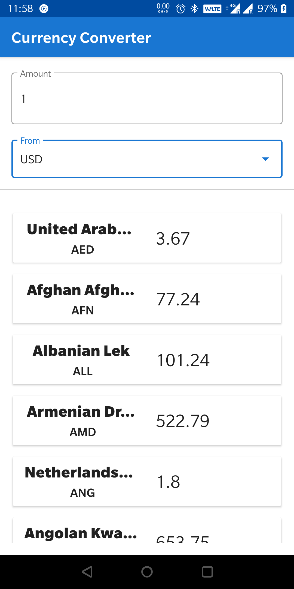

# CurrencyConverter

### Getting Started
App uses Currency Layer API. Register at https://currencylayer.com/ to create your own API key. Paste your API key at 

	`accessKey=api_key` in gradle.properties
